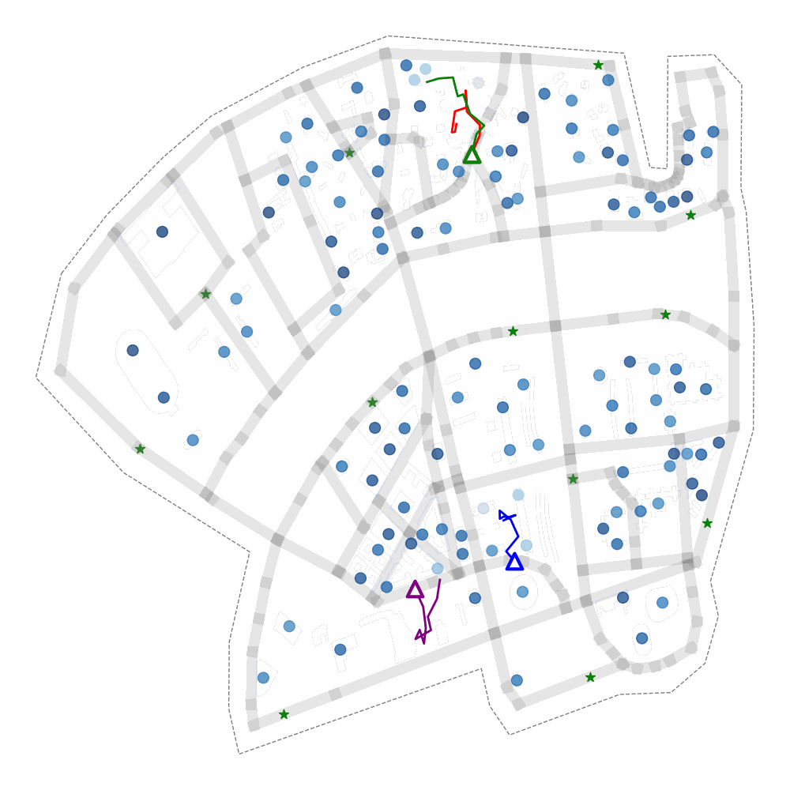

[](https://github.com/NVlabs/SegFormer/blob/master/LICENSE)


# Energy-Efficient Ground-Air-Space Vehicular Crowdsensing by Hierarchical Multi-Agent Deep Reinforcement Learning with Diffusion Models

<!--  -->
<div align="center">
  
</div>
<p align="center">
  Figure 1: Policy Visualization of <i>g</i>MADRL-VCS in ROMA map.
</p>

### [<i>g</i>MADRL-VCS Project](https://github.com/nuomizai/gMADRL-VCS)

This project is the official implementation of <i>g</i>MADRL-VCS,  an energy-efficient, goal-directed
hierarchical multi-agent deep reinforcement learning 
method with discrete diffusion models capable of learning the optimal sensing policy for heterogeneous vehicular crowdsensing.

### Installation

```
conda create -n vcs python=3.8
conda activate vcs
pip install torch==1.13.1+cu117 torchvision==0.14.1+cu117 torchaudio==0.13.1 --extra-index-url https://download.pytorch.org/whl/cu117
pip install -r requirements.txt
```


## Training
Run the following command to train the model on ROMA map.
```
export PYTHONPATH="../gMADRL-VCS/:$PYTHONPATH"
python methods/train.py dataset=ROMA seed=2 device=0 uav_n=4 ugv_n=4
```
To change more parameters, please refer to the file `cfgs/config.yaml`.
Results are saved under ./exp_local


## Visualize results
Config the `file_path` (path contained `save_data.npz`) in `plot/plot.py` and run the following command to plot the metric curve during training.
```
cd plot
python plot.py
```


## Checkpoints
Download the checkpoints from [Google Drive](https://drive.google.com/drive/folders/158856666666666666666666666666666?usp=sharing) and find all the results here.


## Acknowledgement
* [D3PM-Pytorch](https://github.com/ljh0v0/D3PM-Pytorch), Austin et al.
* [GARL](https://github.com/Richard19980527/GARL-Air-Ground-SC-with-UAV-Carriers), Wang et al.


## Contact
If you have any questions, please contact `linda.chao.007@gmail.com`.

## Citation
```
@ARTICLE{10679184,
  author={Zhao, Yinuo and Liu, Chi Harold and Yi, Tianjiao and Li, Guozheng and Wu, Dapeng},
  journal={IEEE Journal on Selected Areas in Communications}, 
  title={Energy-Efficient Ground-Air-Space Vehicular Crowdsensing by Hierarchical Multi-Agent Deep Reinforcement Learning With Diffusion Models}, 
  year={2024},
  volume={42},
  number={12},
  pages={3566-3580},
  doi={10.1109/JSAC.2024.3459039}}

```
